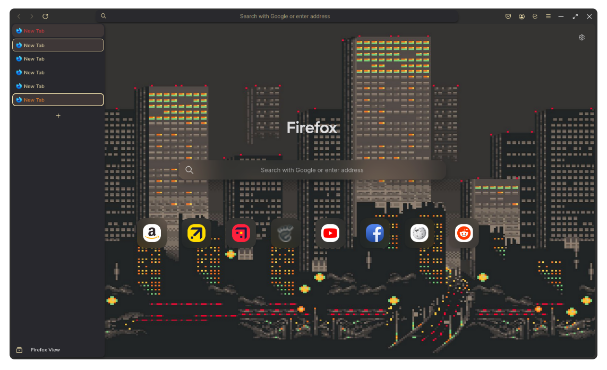

```
FF ULTIMA
Gruvbox Edition
By FF Ultima
```

To use this color scheme:
- Navigate to `about:config` page.
- Search for `user.theme`.
- Turn on `user.theme.gruvbox`

Preview:


Color schemes are easy to create: Learn how with the [Color Scheme](/docs/color-schemes/Create-a-Color-Scheme) Wiki.