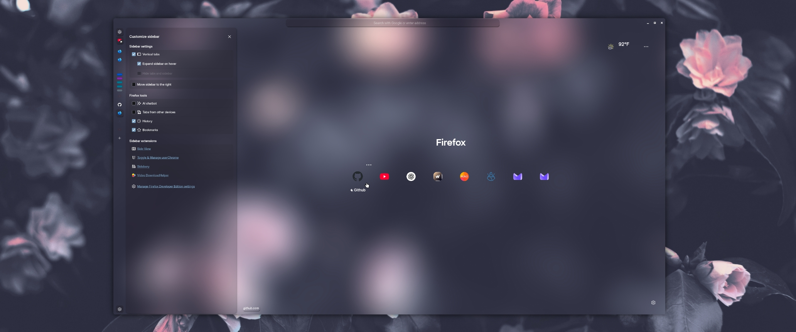
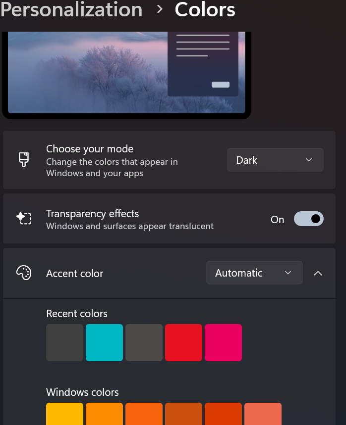

```
FF ULTIMA
Transparent Color Scheme
A Transparent Adaptive Color Scheme, adapted to support Mica & Blur
```

To use this color scheme:
- Navigate to `about:config` page.
- Search for `user.theme`.
- Turn on `user.theme.transparent`
- View transparent/blur support section below

Preview:



---

## Support for Mica or Blurred Windows

FF Ultima supports Mica or Blurred Windows (All Operating Systems) through the use of the [Transparent Color Scheme](https://github.com/soulhotel/FF-ULTIMA/tree/main/theme/color-schemes/transparent/readme.md) (user.theme.transparent). This color scheme simply makes the browser window transparent, and makes sure everything else blends in perfectly with whatever External method you use to enable Blur.

> Note: `user.theme.transparent` will not activate if you have other `user.themes` enabled.


## Windows Setup

1. Firefox about:config
   - In `about:config` - `user.theme.transparent` & `browser.tabs.browser.tabs.allow_transparent_browser` true.
   - The user.js already handles every other necessary setting.

2. Mica4Everyone
   - Ensure your browser is not blacklisted.
   - I believe no other setup is required here.

3. Windows Settings (Personalize)
   - Ensure Transparency effects is set to true and accent color is set to automatic
   - Ensure Accent color is set to `Automatic`

> [#444](https://github.com/soulhotel/FF-ULTIMA/issues/444)



## KDE Setup

1. Blur Desktop Effect (default)
   - In `Desktop Effects` - Enable `✓ Background Contrast` - Enable  `✓ Blur`. 
   - In `Blur Settings ⚙️` - Keep Blur strength high - Keep Noise strength low.

2. Or [kwin-effects-forceblur](https://github.com/taj-ny/kwin-effects-forceblur) (recommended) 
   - In `Desktop Effects` - Enable `✓ Background Contrast` - Enable `✓ Better Blur`.
   - In `Better Blur Settings ⚙️` - Keep Blur strength high, Keep Noise strength low.
   - In `Better Blur Settings ⚙️` - In `Force Blur` - Enable `✓ Blur menus`.
   - Any other settings are up to your own preference.

## Mac Setup

1. I need testers.

## Gnome Setup

1. [Blur My Shell](https://extensions.gnome.org/extension/3193/blur-my-shell/) seems to be the only option for Gnome.
   - In Firefox `about:config` - `browser.tabs.browser.tabs.allow_transparent_browser` true.
   - In Blur My Shell `Settings` - In `Applications` - Enable `Dynamic Blur`,
   - Keep `Focused window opacity` set to `full` for visibility.
   - Ensure Firefox is not blacklisted (is whitelisted).
   - You may have to restart Gnome Shell to see results: `Alt+F2`, type `r`.