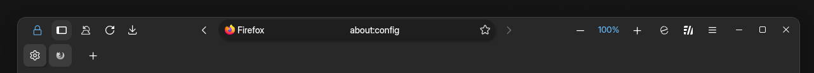

# Tab Settings

> Theme settings are accessible via the `about:config` page. Type `ultima` or `user.theme` to get started.

### Tab positioning
<!--
This is not a "setting" but an "action" that some users may find helpful. To quickly switch between vertical or horizontal tabs
- Right click any toolbar -> `Turn on/off Vertical Tabs`
- Or open the `Settings Sidebar` -> `Turn on/off Vertical Tabs`
<iframe width="70%" height="325" src="https://github.com/user-attachments/assets/ba5f1e26-4ca9-4cdc-882f-b937c7ab660c" title="YouTube video player" frameborder="0" allow="accelerometer; autoplay; clipboard-write; encrypted-media; gyroscope; picture-in-picture; web-share; fullscreen" referrerpolicy="strict-origin-when-cross-origin" allowfullscreen></iframe>

### Autohide vertical tabs

This is not a "setting" but an "action" that some users may find helpful. To autohide the vertical tab bar
- Open the `Settings Sidebar` -> Turn on `Expand sidebar on hover`
<iframe width="70%" height="325" src="https://github.com/user-attachments/assets/fb36e5e9-50b7-4c1d-9536-3ce43f72c65a" title="YouTube video player" frameborder="0" allow="accelerometer; autoplay; clipboard-write; encrypted-media; gyroscope; picture-in-picture; web-share; fullscreen" referrerpolicy="strict-origin-when-cross-origin" allowfullscreen></iframe>
-->
### ultima.tabs.belowURLbar

When using horizontal tabs, toggle between tabs on top, or tabs under the urlbar

### ultima.tabs.closetabbutton.on.icon

Hovering over a tabs icon will present the "close tab" button

### ultima.tabs.tabCounter

Display a counter/indicator for the total amount of tabs open in the container

<iframe width="100%" height="490" src="https://www.youtube.com/embed/gkvQmEWVFkk?si=AYRt4ztV8Hwuls9L" title="YouTube video player" frameborder="0" allow="accelerometer; autoplay; clipboard-write; encrypted-media; gyroscope; picture-in-picture; web-share; fullscreen" referrerpolicy="strict-origin-when-cross-origin" allowfullscreen></iframe>

### ultima.spacing.compact.tabs

This reduces the spacing between vertical tabs, letting more tabs fit in-screen

### ultima.tabs.disable.scrollbar

This setting hides the scrollbar within the vertical tabs container

### ultima.tabs.disable.update.dot

to hide the update dot that appears on unselected tabs

### ultima.tabs.always.show.pinned

To put it simply, this setting forces the `pinned tab container` to <ins>always show all</ins> pinned tabs. Removing the scrolling limit.

### ultima.tabs.multiline.labels

Tabs can span multiple lines. This setting is a personal favorite. Only works with vertical tabs.

### ultima.tabs.reverse.content.order

This setting simply reverses the order in which things appear in a tab. Close button first, label second, icon last. Here's an example of it in action, with multiline tabs.

### user.theme.xtras.tab.outline.color

You can specify a tab outline color by typing in a color (or gradient). Leave empty for no outline.

### ultima.tabs.not.a.progress.bar

This setting simulates the tab loading strip you see on some websites like youtube, reddit, etc. It works by tracking the loading favicon for the selected (loading) tab. It isn't actually a loading bar but it's consistent.

### ultima.tabs.vertical.hide (hiding the vertical tab bar)

`ultima.tabs.vertical.hide` will hide vertical tabs completely (great for Sidebery setups)
- when combined with `ultima.tabs.vertical.hide.in.screencorner`, vertical tabs will be hidden at the bottom corner of the screen
- or combined with `ultima.tabs.vertical.hide.in.screenedge`, vertical tabs will be hidden in the screen edge

<iframe width="100%" height="490" src="https://github.com/user-attachments/assets/20241a30-a7c5-4430-a6b5-ad65433005f9" title="YouTube video player" frameborder="0" allow="accelerometer; autoplay; clipboard-write; encrypted-media; gyroscope; picture-in-picture; web-share; fullscreen" referrerpolicy="strict-origin-when-cross-origin" allowfullscreen></iframe>

:::warning important

For stability, `ultima.tabs.vertical.hide` is reliant on ExpandonHover being `ON`. This allows a consistent experience across the browser, whether in private browsing, or a different OS.
 

If you're interested in a Sidebery configuration be sure to check out the documentation [here](../sidebery)
:::

### ultima.tabs.newtabbutton.ontop

when using with vertical tabs, you can change the positioning of the new tab button with `ultima.tabs.newtabbutton.ontop.1` and `ultima.tabs.newtabbutton.ontop.2`
1. at the absolute top of all tabs
2. at the top of tabs, under pinned tabs

<iframe width="100%" height="530" src="https://github.com/user-attachments/assets/f4fa2ffd-49cb-4aea-b8d0-0e2eb2bdd502" title="YouTube video player" frameborder="0" allow="accelerometer; autoplay; clipboard-write; encrypted-media; gyroscope; picture-in-picture; web-share; fullscreen" referrerpolicy="strict-origin-when-cross-origin" allowfullscreen></iframe>

### ultima.tabs.tabgroups

Tab groups are styled in two seperate ways. Choose only one label style.

- tabgroups.label.1 is a circular style
- tabgroups.label.2 is a compact pill style label 
- tabgroups.label.3 is an arrow dropdown style

>
Tab group backgrounds are more flexible. They can be used seperately or combined.

- tabgroups.background.1 is a full tab group colored background
- tabgroups.background.2 is an animated gradient background
- tabgroups.background.3 is the default tab group line background
- tabgroups.background.4 seperates the tabs in a dotted border

### ultima.xstyle.containertabs

You can choose one style for container tabs with: `ultima.xstyle.containertabs.i` (i, ii, iii)
<iframe width="100%" height="533" src="https://github.com/user-attachments/assets/9fa05514-6477-4dff-bd78-e050bf89f857" title="YouTube video player" frameborder="0" allow="accelerometer; autoplay; clipboard-write; encrypted-media; gyroscope; picture-in-picture; web-share; fullscreen" referrerpolicy="strict-origin-when-cross-origin" allowfullscreen></iframe>

### ultima.tabs.vertical.hide.the.bottom.button

- `hide.the.bottom.button` will hide all action buttons at the bottom of vertical tabs (except for Settings)
- `hide.the.bottom.buttons.off.hover` will hide all action buttons (except for Settings) until you hover over the vertical tabs

### ultima.tabs.horizontal.fullwidth

Horizontal tabs take up as much width as possible

<iframe width="100%" height="490" src="https://github.com/user-attachments/assets/f088369a-d4d0-48dd-ac16-129398969d47" title="YouTube video player" frameborder="0" allow="accelerometer; autoplay; clipboard-write; encrypted-media; gyroscope; picture-in-picture; web-share; fullscreen" referrerpolicy="strict-origin-when-cross-origin" allowfullscreen></iframe>

### ultima.tabs.focus.blur

Focus/Hovering over a tab will blur all other tabs

### ultima.tabs.splitview.content.outline

By default when using split view, the focused tab is surrounded by a border outline, this setting lets you toggle it on or off

### ultima.tabs.splitview.focus.opacity

When using split view, the view that is not in focus fades out in opacity (becomes less visible)

<iframe width="100%" height="490" src="/img/settings/splitvieww.mp4" title="YouTube video player" frameborder="0" allow="accelerometer; autoplay; clipboard-write; encrypted-media; gyroscope; picture-in-picture; web-share; fullscreen" referrerpolicy="strict-origin-when-cross-origin" allowfullscreen></iframe>

### ultima.tabs.splitview.focus.shrink

When using split view, the second view (when not focused) shrinks down to 30% of the windows width (portrait size)

<iframe width="100%" height="490" src="/img/settings/splitvieww.mp4" title="YouTube video player" frameborder="0" allow="accelerometer; autoplay; clipboard-write; encrypted-media; gyroscope; picture-in-picture; web-share; fullscreen" referrerpolicy="strict-origin-when-cross-origin" allowfullscreen></iframe>

### ultima.tabs.splitview.tab.seperator

By default when using split view, the combined tabs in the tab container have a visible seperator line, this setting lets you toggle it on or off

### ultima.tabs.splitview.tab.gradient

This setting changes the combined tabs background color to a subtle gradient

