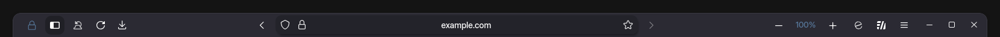

# URL bar Settings

> Theme settings are accessible via the `about:config` page. Type `ultima` or `user.theme` to get started.

### ultima.urlbar.float

The urlbar floats, by popping down and scaling up
<iframe width="80%" height="329" src="https://github.com/user-attachments/assets/f0c7744a-f527-4025-b300-191922babacb" title="YouTube video player" frameborder="0" allow="accelerometer; autoplay; clipboard-write; encrypted-media; gyroscope; picture-in-picture; web-share; fullscreen" referrerpolicy="strict-origin-when-cross-origin" allowfullscreen></iframe>

### ultima.urlbar.animate.open

The urlbar slides out when focused, this can be combined with a floating urlbar (like above)

### ultima.urlbar.animate.options

a useless setting that still exist

### ultima.urlbar.centered

This centers the text within the urlbar. To center the urlbar itself, just use `spacers` on the customize toolbar page

### ultima.urlbar.drags.window

you can drag the browser from the url bar, it's a bit of a nuisance because clicking the urlbar does focus it

### ultima.urlbar.hide.buttons

This hides the buttons within the urlbar, off hover

### ultima.urlbar.hide.searchsuggestions

This hides the "This time search with" url bar suggestions, when used with the new "bonnet" switcher, it hides that.

### ultima.urlbar.transparent

This forces a transparent background on the urlbar when not in use

